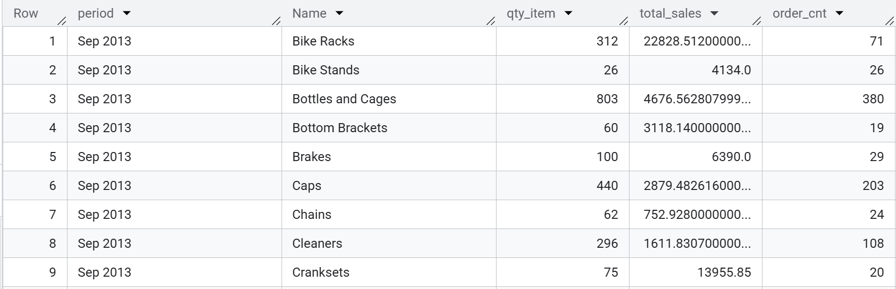
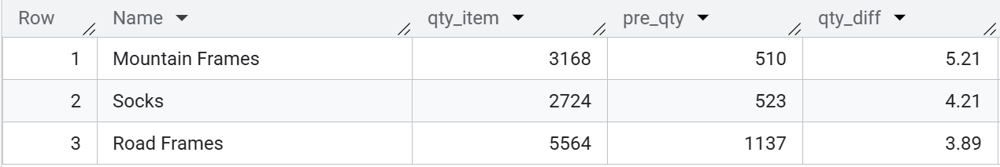
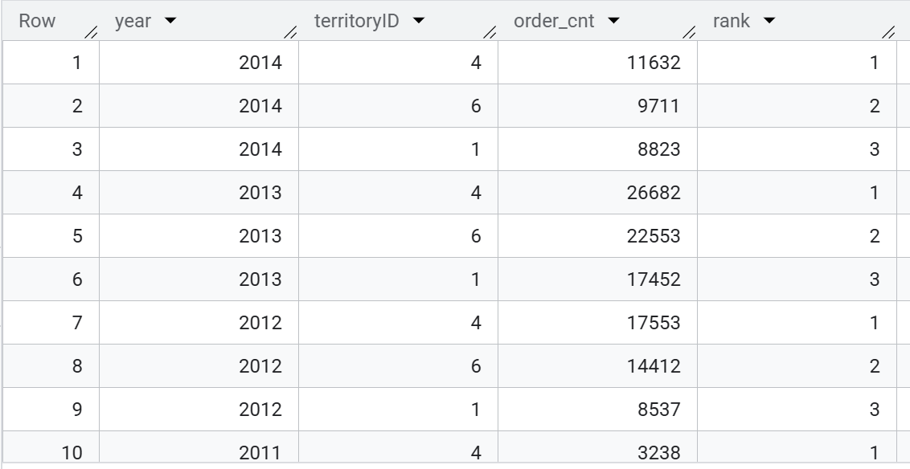
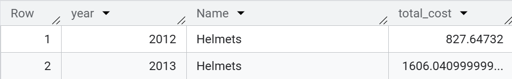
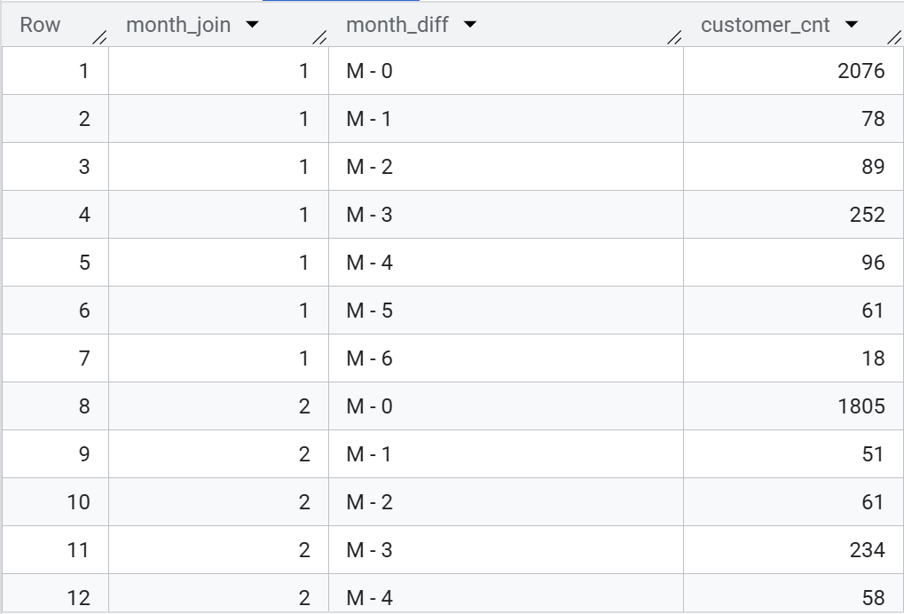
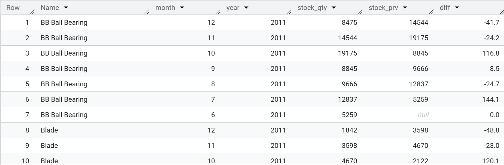
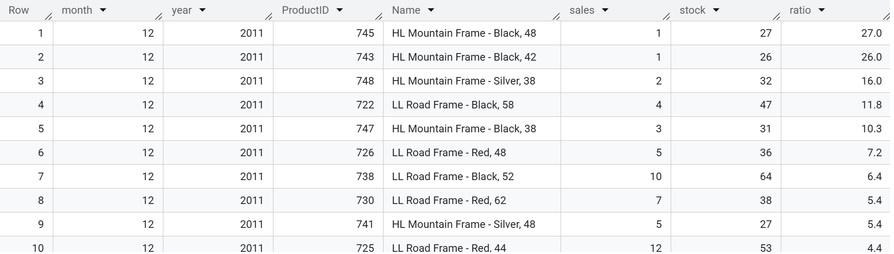
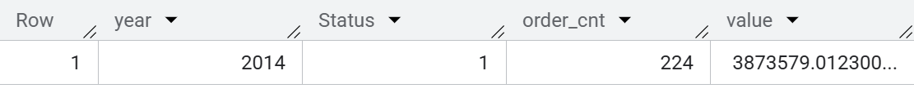

# SQL-Bicycle-Manufacturer-Project

🔗 **BigQuery Dataset**: [Link](https://console.cloud.google.com/bigquery?ws=!1m7!1m6!12m5!1m3!1suni-sql-project-1!2sus-central1!3s8d7a2346-c3a7-4a38-81eb-b93b49c60eeb!2e1)


## 1. Project Overview
- This project utilizes the AdventureWorks dataset developed by Microsoft, which simulates the operations of a company specializing in manufacturing and distributing bicycles, accessories, and related equipment. The dataset includes multiple tables that reflect core aspects of a business such as sales, production, inventory management, customers, and human resources.
- The queries are designed to analyze sales performance, units sold, year-over-year growth, the effectiveness of discount programs, customer behavior over time (cohort analysis), as well as inventory trends and the relationship between stock levels and consumption.
## 2. Analysis

### 1️⃣ Query 01: Calc Quantity of items, Sales value & Order quantity by each Subcategory in L12M (find out The lastest date, and then get data in last 12 months)
```sql
WITH tb_sales AS (
    SELECT 
          FORMAT_DATE('%b %Y', ModifiedDate) AS period
          ,ProductID
          ,OrderQty
          ,LineTotal
          ,SalesOrderID
    FROM `adventureworks2019.Sales.SalesOrderDetail` AS sales
    WHERE DATE(ModifiedDate) >= (SELECT DATE_SUB(DATE(MAX(ModifiedDate)), INTERVAL 12 MONTH) FROM `adventureworks2019.Sales.SalesOrderDetail`)
)

SELECT 
      period
      ,sub.Name
      ,SUM(OrderQty) AS qty_item
      ,SUM(LineTotal) AS total_sales
      ,COUNT(DISTINCT SalesOrderID) order_cnt
FROM tb_sales
INNER JOIN adventureworks2019.Production.Product AS pro USING (ProductID)
INNER JOIN adventureworks2019.Production.ProductSubcategory AS sub
  ON CAST(pro.ProductSubcategoryID AS INT64) = sub.ProductSubcategoryID
GROUP BY 1,2
ORDER BY 1 DESC,2;
```



### 2️⃣ Query 02: Calc % YoY growth rate by SubCategory & release top 3 cat with highest grow rate. Can use metric: quantity_item. Round results to 2 decimal
``` sql
WITH qty AS (
    SELECT 
          sub.Name
          ,EXTRACT(year FROM sales.ModifiedDate) AS year
          ,SUM(sales.OrderQty) AS qty_item
    FROM adventureworks2019.Sales.SalesOrderDetail AS sales 
    INNER JOIN adventureworks2019.Production.Product AS pro USING (ProductID)
    INNER JOIN adventureworks2019.Production.ProductSubcategory AS sub
      ON CAST(pro.ProductSubcategoryID AS INT64) = sub.ProductSubcategoryID
    GROUP BY 1,2
)

SELECT 
    Name
    ,qty_item
    ,LAG(qty_item,1) OVER(PARTITION BY Name ORDER BY year) AS pre_qty
    ,ROUND((qty_item/LAG(qty_item,1) OVER(PARTITION BY Name ORDER BY year))-1,2) AS qty_diff
FROM qty
ORDER BY qty_diff DESC
LIMIT 3;
```



### 3️⃣ Query 3: Ranking Top 3 TeritoryID with biggest Order quantity of every year. If there's TerritoryID with same quantity in a year, do not skip the rank number
``` sql
WITH tb_territory AS (
    SELECT 
          EXTRACT (year FROM salesdetail.ModifiedDate) AS year 
          ,saleshead.territoryID
          ,SUM(salesdetail.OrderQty) AS order_cnt
    FROM adventureworks2019.Sales.SalesOrderHeader AS saleshead
    LEFT JOIN adventureworks2019.Sales.SalesOrderDetail AS salesdetail
      USING (SalesOrderID)
    GROUP BY 1,2
)
SELECT *
FROM (SELECT 
            year
            ,territoryID
            ,order_cnt
            ,DENSE_RANK() OVER (PARTITION BY year ORDER BY order_cnt DESC) AS rank FROM tb_territory)
WHERE rank <=3
ORDER BY 1 DESC;
```



### 4️⃣ Query 04: Calc Total Discount Cost belongs to Seasonal Discount for each SubCategory
``` sql
SELECT 
      EXTRACT(year FROM salesdetail.ModifiedDate) year
      ,sub.Name
      ,SUM(OrderQty * UnitPrice * UnitPriceDiscount) AS total_cost
FROM adventureworks2019.Sales.SalesOrderDetail AS salesdetail
INNER JOIN adventureworks2019.Production.Product AS pro
  USING (ProductID)
INNER JOIN adventureworks2019.Production.ProductSubcategory AS sub
  ON CAST(pro.ProductSubcategoryID AS INT64) = sub.ProductSubcategoryID
WHERE SpecialOfferID IN (SELECT SpecialOfferID
                        FROM adventureworks2019.Sales.SpecialOffer
                        WHERE LOWER(Type) LIKE '%seasonal discount%')
GROUP BY 1,2;
```



### 5️⃣ Query 05: Retention rate of Customer in 2014 with status of Successfully Shipped (Cohort Analysis)
```sql
WITH all_month AS (
    SELECT 
          EXTRACT (month FROM ModifiedDate) AS month
          ,CustomerID 
    FROM adventureworks2019.Sales.SalesOrderHeader
    WHERE Status = 5
          AND EXTRACT (year FROM ModifiedDate) = 2014
)

,rank_1 AS (
    SELECT 
          month AS month_join
          ,CustomerID
    FROM (SELECT *
                ,RANK() OVER(PARTITION BY CustomerID ORDER BY month) AS rank
          FROM all_month)
    WHERE rank = 1
)

SELECT 
      rank_1.month_join
      ,CONCAT('M - ',all_month.month - rank_1.month_join) AS month_diff
      ,COUNT (DISTINCT CustomerID) AS customer_cnt
FROM all_month
LEFT JOIN rank_1 
  USING (CustomerID)
GROUP BY 1,2
ORDER BY 1,2;
```



### 6️⃣ Query 06: Trend of Stock level & MoM diff % by all product in 2011. If %gr rate is null then 0. Round to 1 decimal
```sql
WITH tb_stock_qty AS (
    SELECT 
          Name
          ,EXTRACT (month FROM workorder.ModifiedDate) AS month
          ,SUM(StockedQty) AS stock_qty
    FROM adventureworks2019.Production.WorkOrder AS workorder
    INNER JOIN adventureworks2019.Production.Product AS product
      USING (ProductID)
    WHERE EXTRACT(year FROM workorder.ModifiedDate) = 2011
    GROUP BY 1,2
)
SELECT 
      Name
      ,month
      ,2011 AS year 
      ,stock_qty
      ,stock_prv
      ,IFNULL(ROUND((stock_qty-stock_prv)*100/stock_prv,1),0) diff
FROM (SELECT
            *
            ,LAG(stock_qty,1) OVER (PARTITION BY Name ORDER BY month) AS stock_prv
      FROM tb_stock_qty)
ORDER BY 1,2 DESC;
```



### 7️⃣  Query 07: Calc Ratio of Stock / Sales in 2011 by product name, by month Order results by month desc, ratio desc. Round Ratio to 1 decimal mom yoy
```sql
WITH 
tb_sales AS (
    SELECT 
          EXTRACT (month FROM detail.ModifiedDate) AS month
          ,detail.ProductID 
          ,Name 
          ,SUM(OrderQty) AS sales
    FROM adventureworks2019.Sales.SalesOrderDetail AS detail
    LEFT JOIN adventureworks2019.Production.Product AS product
      USING (ProductID)
    WHERE EXTRACT (year FROM detail.ModifiedDate) = 2011 
    GROUP BY 1,2,3
)
,tb_stock AS (
    SELECT 
          EXTRACT (month FROM ModifiedDate) AS month
          ,ProductID
          ,SUM(StockedQty) AS stock
    FROM adventureworks2019.Production.WorkOrder AS workorder
    WHERE EXTRACT (year FROM ModifiedDate) = 2011
    GROUP BY 1,2
)

SELECT tb_sales.month
      ,2011 AS year 
      ,tb_sales.ProductID 
      ,Name
      ,sales 
      ,stock
      ,IFNULL (ROUND(stock/sales,1),0) AS ratio
FROM tb_sales 
LEFT JOIN tb_stock 
  ON tb_sales.ProductID = tb_stock.ProductID
  AND tb_sales.month = tb_stock.month
ORDER BY 1 DESC, ratio DESC;
```



### 8️⃣ Query 08: No of order and value at Pending status in 2014
```sql
SELECT 
      EXTRACT (year FROM ModifiedDate) AS year 
      ,Status
      ,COUNT (DISTINCT PurchaseOrderID) AS order_cnt
      ,SUM(TotalDue) AS value
FROM adventureworks2019.Purchasing.PurchaseOrderHeader
WHERE EXTRACT (year FROM ModifiedDate) = 2014
      AND Status = 1
GROUP BY 1,2;
```




